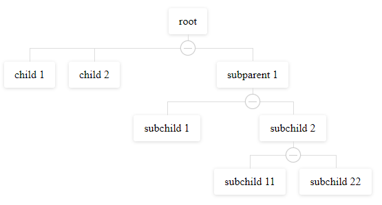
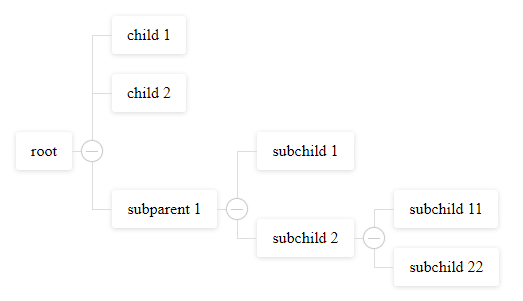
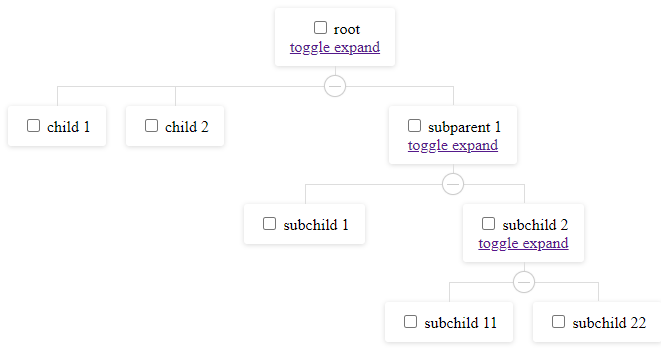

# vue3-blocks-tree

> A simple organization structure tree view based on Vue3.x. It supports events, slots, horizontal vision and nodes manipulation

Thanks to [hukaibaihu](https://github.com/hukaibaihu/vue-org-tree) and his sources for vue 2 taken as basis.

## Usage
```vue

<template>
    <h1>Basic</h1>
    <div>
        <blocks-tree :data="treeData" :horizontal="treeOrientation=='1'"  :collapsable="true"></blocks-tree>
    </div>

    <h1>With slots</h1>
    <div>
        <blocks-tree :data="treeData" :horizontal="treeOrientation=='1'" :collapsable="true" :props="{label: 'label', expand: 'expand', children: 'children',  key:'some_id'}">
        <template #node="{data,context}">
            <span>
                <input type="checkbox" :checked="selected.indexOf(data.some_id)> -1" @change="(e)=>toggleSelect(data,e.target.checked)"/> {{data.label}}
            </span>
            <br/>
            <span v-if="data.children && data.children.length">
                <a href="#" @click="context.toggleExpand">toggle expand</a>
            </span>
        </template>
        </blocks-tree>
        <div>
        Selected: {{selected}}
        </div>
    </div>

    <h1>Change orientation</h1>
    <select v-model="treeOrientation">
        <option value="0">Vertical</option>
        <option value="1">Horizontal</option>
    </select>

</template>
<script>
import { defineComponent,ref,reactive } from 'vue';

export default defineComponent({

    setup() {

        let selected = ref([]);
        let treeOrientation = ref("0");
        let treeData = reactive({
            label: 'root',
            expand: true,
            some_id: 1,
            children: [
                { label: 'child 1', some_id: 2, },
                { label: 'child 2', some_id: 3, },
                { 
                    label: 'subparent 1', 
                    some_id: 4, 
                    expand: false, 
                    children: [
                        { label: 'subchild 1', some_id: 5 },
                        {  
                            label: 'subchild 2', 
                            some_id: 6, 
                            expand: false, 
                            children: [
                                { label: 'subchild 11', some_id: 7 },
                                { label: 'subchild 22', some_id: 8 },
                            ]
                        },
                    ]
                },
            ]
        });

        const toggleSelect = (node, isSelected) => {
            isSelected ? selected.value.push(node.some_id) : selected.value.splice(selected.value.indexOf(node.some_id), 1);
            if(node.children && node.children.length) {
                node.children.forEach(ch=>{
                    toggleSelect(ch,isSelected)
                })
            }
        }

        return {
            treeData,
            selected,
            toggleSelect,
            treeOrientation
        }
    }
})

</script>

```

### Demo


[https://megafetis.github.io/vue3-blocks-tree-demo]


### NPM

```
# use npm
npm i vue3-blocks-tree

# use yarn
yarn add vue3-blocks-tree
```
### Import Plugins

``` js
import {createApp} from 'vue';
import VueBlocksTree from 'vue3-blocks-tree';
import 'vue3-blocks-tree/dist/vue3-blocks-tree.css';
// or import 'vue3-blocks-tree/src/styles/blocks-tree.less';

let defaultoptions = {treeName:'blocks-tree'}

createApp(App)
    .use(VueBlocksTree,defaultoptions)
    // or .component('blocks-tree',VueBlocksTree)

// ...
```


## API

  api               | descripton                                                  | type
  ------------------|-------------------------------------------------------------|:---------------------------------------------------------------------
  node context      |  Context to node manipulation  in slot or in event callback | interface NodeContext { isExpanded():boolean;  toggleExpand():void; }


#### props

  prop              | descripton                              | type                   | default
  ------------------|-----------------------------------------|:----------------------:|:---------------------------------------------------------:
  data              |                                         | `Object`               |
  props             |  configure props                        | `Object`               | `{label: 'label', children: 'children', expand: 'expand',key: 'id'}`
  labelWidth        |  node label width                       | `String` \| `Number`   | `auto`
  collapsable       |  children node is collapsable           | `Boolean`              | `true`
  renderContent     |  how to render node label               | `Function`             |     -
  labelClassName    |  node label class                       | `Function` \| `String` |     -


### events

  event name        | descripton                              | type
  ------------------|-----------------------------------------|:----------------------
  node-click        |  Click event                            | `Function`
  node-mouseover    |  onMouseOver event                      | `Function`
  node-mouseout     |  onMouseOut event                       | `Function`
  node-expand       |  click expand button event              | `Function`

### Slots

  slot name         | descripton                              | params
  ------------------|-----------------------------------------|:----------------------
  node              |  current node scoped slot               | data - node data, context - node context

#### node-expand
well be called when the collapse-btn clicked

- params `e` `Event`
- params `data` `Current node data`
- params `context` `Node context`

#### node-click
well be called when the node-label clicked

- params `e` `Event`
- params `data` `Current node data`
- params `context` `Node context`

#### node-mouseover
It is called when the mouse hovers over the label.

- params `e` `Event`
- params `data` `Current node data`
- params `context` `Node context`

#### node-mouseout
It is called when the mouse leaves the label.

- params `e` `Event`
- params `data` `Current node data`
- params `context` `Node context`

## Example

- default

  

- horizontal

  

- use node slot

  


## License
[MIT](http://opensource.org/licenses/MIT)

<a href="https://www.buymeacoffee.com/megafetis" target="_blank"></a>